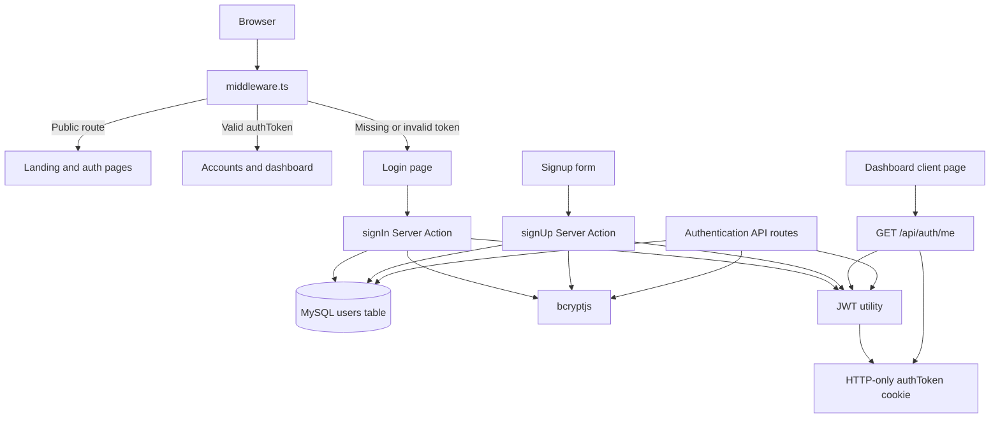

# Invoice Management Application

## 1. Project Overview

This project is a full-stack invoice-management prototype built with **Next.js App Router**, **React 19**, **TypeScript**, **Tailwind CSS**, **MySQL**, **bcryptjs**, and **JSON Web Tokens (JWT)**.

The current implementation provides:

- A public invoice-management landing page.
- User registration and login forms.
- MySQL-backed user persistence.
- Password hashing with bcryptjs.
- JWT-based authentication stored in an HTTP-only cookie.
- Middleware-based protection for account and dashboard routes.
- A dashboard shell with sidebar navigation, summary cards, and quick-action links.
- REST-style authentication API routes.
- Reusable UI primitives based on Radix/shadcn patterns.

The invoice and client management areas are currently represented by dashboard UI and placeholder links. The repository does not yet contain invoice, client, payment, or reporting database models and APIs.

## 2. Technology Stack

| Area | Technology |
|---|---|
| Framework | Next.js `15.5.x` |
| Rendering model | Next.js App Router with Server and Client Components |
| Language | TypeScript `5.x` |
| UI runtime | React `19.1.0` |
| Styling | Tailwind CSS `4.x`, PostCSS, custom CSS variables |
| UI primitives | Radix UI/shadcn-style components |
| Icons | `lucide-react` |
| Database | MySQL through `mysql2/promise` |
| Password security | `bcryptjs` |
| Authentication | JWT through `jsonwebtoken` |
| Build tool | Next.js Turbopack |
| Linting | ESLint 9 with `eslint-config-next` |
| Fonts | Geist and Geist Mono through `next/font/google` |

## 3. Directory Structure

```text
invoice/
├── components.json                 # shadcn/component configuration
├── eslint.config.mjs               # ESLint configuration
├── middleware.ts                   # Route authentication middleware
├── next-env.d.ts                   # Next.js generated TypeScript declarations
├── next.config.ts                  # Next.js/Turbopack configuration
├── package.json                    # Scripts and dependencies
├── postcss.config.mjs              # PostCSS/Tailwind integration
├── README.md                       # Starter README
├── tailwind.config.js              # Tailwind configuration
├── tsconfig.json                   # TypeScript configuration
├── test-auth-api.ps1               # PowerShell authentication API test script
│
├── database/
│   └── create-users-table.sql      # MySQL users table schema
│
├── public/                         # Static assets such as logos and favicon
│
├── src/
│   ├── actions/
│   │   └── auth.ts                 # Server Actions for signup, signin, signout
│   │
│   ├── app/
│   │   ├── globals.css             # Global styles, design tokens, utilities
│   │   ├── layout.tsx              # Root layout, metadata, fonts, initializer
│   │   ├── page.tsx                # Public landing page at /
│   │   ├── page.module.css         # Page-specific CSS module
│   │   │
│   │   ├── accounts/
│   │   │   ├── page.tsx            # Accounts page using ClientComponent
│   │   │   ├── (auth)/              # Route group; omitted from URL paths
│   │   │   │   ├── login/page.tsx   # Auth-group login page
│   │   │   │   └── signup/page.tsx  # Auth-group signup page
│   │   │   ├── auth/
│   │   │   │   ├── confirm/route.ts # Email-confirmation placeholder
│   │   │   │   ├── login/page.tsx   # Alternate login page
│   │   │   │   └── signup/page.tsx  # Alternate signup page
│   │   │
│   │   │   ├── api/
│   │   │   │   ├── auth/
│   │   │   │   │   ├── login/route.ts  # POST login API
│   │   │   │   │   ├── logout/route.ts # POST logout API
│   │   │   │   │   ├── me/route.ts     # GET current user API
│   │   │   │   │   └── signup/route.ts # POST signup API
│   │   │   │   └── health/route.ts     # Health endpoint
│   │   │
│   │   │   └── dashboard/page.tsx  # Authenticated dashboard client page
│   │   │
│   │   └── components/
│   │       ├── AppInitializer.tsx  # Currently a no-op initializer
│   │       ├── AuthButton.tsx       # Login/signup submit button
│   │       ├── LoginFacebook.tsx    # Facebook login-related component
│   │       ├── LoginForm.tsx        # Client login form
│   │       ├── SignupForm.tsx       # Client signup form
│   │       └── ui/                  # Shared UI components
│   │           ├── AppSidebar.tsx
│   │           ├── Navbar.tsx
│   │           ├── avatar.tsx
│   │           ├── button.tsx
│   │           ├── card.tsx
│   │           ├── dropdown-menu.tsx
│   │           ├── input.tsx
│   │           ├── separator.tsx
│   │           ├── sheet.tsx
│   │           ├── sidebar.tsx
│   │           ├── skeleton.tsx
│   │           └── tooltip.tsx
│   │
│   ├── hooks/
│   │   └── use-mobile.ts           # Responsive/mobile detection hook
│   │
│   └── lib/
│       ├── auth-interfaces.ts      # Shared auth and API TypeScript types
│       ├── databse.tsx             # Existing file with a probable spelling issue
│       ├── db.ts                   # MySQL pool and query helpers
│       ├── init.ts                 # Application/database initialization helper
│       ├── jwt.ts                  # JWT creation, verification, extraction
│       ├── password.ts             # Password hashing and verification
│       └── utils.ts                # Shared utility functions
│
└── utils/                          # Currently present but no documented implementation
```

## 4. Application Architecture



### Main layers

1. **Presentation layer**
   - App Router pages under `src/app`.
   - Client forms under `src/components`.
   - Reusable UI components under `src/components/ui`.

2. **Request protection layer**
   - `middleware.ts` checks the `authToken` cookie for configured protected paths.
   - Valid JWT claims are copied into request headers such as `x-user-id`, `x-user-email`, and `x-user-role`.

3. **Authentication layer**
   - `src/actions/auth.ts` contains Server Actions.
   - `src/app/api/auth/*/route.ts` contains HTTP API equivalents.
   - `src/lib/jwt.ts` creates and verifies tokens.
   - `src/lib/password.ts` hashes and checks passwords.

4. **Persistence layer**
   - `src/lib/db.ts` maintains a MySQL connection pool.
   - `database/create-users-table.sql` defines the current database table.

## 5. Route Inventory

### User-facing routes

| URL | Source | Purpose | Current status |
|---|---|---|---|
| `/` | `src/app/page.tsx` | Marketing/landing page | Implemented with static content |
| `/accounts` | `src/app/accounts/page.tsx` | Accounts entry page | Implemented, uses a generic client component |
| `/accounts/auth/login` | `src/app/accounts/auth/login/page.tsx` | Login page | Implemented |
| `/accounts/auth/signup` | `src/app/accounts/auth/signup/page.tsx` | Signup page | Implemented |
| `/accounts/auth/confirm` | `src/app/accounts/auth/confirm/route.ts` | Email confirmation callback | Placeholder only |
| `/dashboard` | `src/app/dashboard/page.tsx` | Authenticated dashboard | Implemented with static invoice/client stats |

The `(auth)` folder is a Next.js route group. Its folder name is not included in the URL. Therefore, `src/app/accounts/(auth)/login/page.tsx` also resolves to `/accounts/login`, not `/accounts/(auth)/login`.

### API routes

| Method | URL | Purpose |
|---|---|---|
| `POST` | `/api/auth/login` | Authenticate an existing user and set `authToken` |
| `POST` | `/api/auth/signup` | Create a user, issue a token, and set `authToken` |
| `POST` | `/api/auth/logout` | Expire the `authToken` cookie |
| `GET` | `/api/auth/me` | Verify the cookie and return current user claims |
| `GET` | `/api/health` | Health check endpoint |

## 6. Authentication Flow

### Signup

1. The user enters email, username, password, and confirmation password.
2. `SignupForm` performs client-side validation.
3. A `FormData` object is sent to the `signUp` Server Action.
4. The action initializes the MySQL pool if needed.
5. The database is checked for an existing email.
6. The password is hashed with bcryptjs.
7. A customer record is inserted into `users`.
8. A seven-day HS256 JWT is generated.
9. The token is stored in an HTTP-only, same-site cookie named `authToken`.
10. The client navigates to the root path.

### Login

1. `LoginForm` validates the email and password fields.
2. The `signIn` Server Action queries the user by email.
3. The submitted password is checked against `password_hash`.
4. A JWT is generated after successful verification.
5. The JWT is stored in the same HTTP-only cookie.
6. The client navigates to the root path.

The API login and signup routes implement a parallel JSON-based flow for clients that do not use the React forms.

### Current-user lookup

`GET /api/auth/me` reads `authToken` from the request cookies and calls `verifyToken`. It returns the user claims without performing a database lookup.

### Logout

The API logout route expires the cookie. The `signOut` Server Action also deletes the cookie and redirects to `/accounts/auth/login`.

## 7. Database Model

The current schema contains one table:

```sql
users (
  id            INT AUTO_INCREMENT PRIMARY KEY,
  email         VARCHAR(255) UNIQUE NOT NULL,
  username      VARCHAR(255) UNIQUE NOT NULL,
  password_hash VARCHAR(255) NOT NULL,
  role          VARCHAR(50) DEFAULT 'customer',
  created_at    TIMESTAMP DEFAULT CURRENT_TIMESTAMP,
  updated_at    TIMESTAMP DEFAULT CURRENT_TIMESTAMP ON UPDATE CURRENT_TIMESTAMP
)
```

The application expects these environment variables:

```env
DATABASE_HOST=localhost
DATABASE_USER=root
DATABASE_PASSWORD=your-password
DATABASE_NAME=your-database
JWT_SECRET=replace-with-a-long-random-secret
```

Defaults exist in `src/lib/db.ts` and `src/lib/jwt.ts`, but production deployments should explicitly define all values, especially `JWT_SECRET`.

## 8. Database Utility Behavior

`src/lib/db.ts` exposes:

- `initializePool()` - Creates and tests a MySQL connection pool.
- `getPool()` - Returns the existing pool or throws if it has not been initialized.
- `isDbConnected()` - Reports the current connection state.
- `query<T>()` - Executes a parameterized query returning multiple rows.
- `queryOne<T>()` - Returns the first row or `null`.
- `execute()` - Executes insert/update/delete statements and returns `lastId` and `affectedRows`.
- `closePool()` - Closes all pool connections.

The code uses `?` placeholders, which is the correct pattern for keeping user input separate from SQL statements.

## 9. UI and Styling

The visual system is defined primarily in `src/app/globals.css` and Tailwind utility classes.

The project includes:

- Blue, purple, green, and custom brand color variables.
- Light and dark shadcn-style design tokens.
- Gradient utility classes.
- Sidebar, card, avatar, dropdown, sheet, skeleton, tooltip, input, and button primitives.
- Responsive Tailwind classes for mobile and desktop layouts.
- Geist font variables configured in the root layout.

The dashboard uses:

- `SidebarProvider` and `AppSidebar` for navigation.
- `Card` components for statistics and actions.
- Lucide icons for invoices, users, trends, alerts, and status indicators.
- A client-side request to `/api/auth/me` before rendering authenticated content.

## 10. Local Development

### Prerequisites

- Node.js compatible with the installed Next.js version.
- npm.
- MySQL server.
- A database created for the application.

### Install dependencies

```bash
npm install
```

### Create the users table

Run `database/create-users-table.sql` against the configured MySQL database.

### Configure environment variables

Create a local `.env.local` file in the project root:

```env
DATABASE_HOST=localhost
DATABASE_USER=root
DATABASE_PASSWORD=your-password
DATABASE_NAME=invoice
JWT_SECRET=use-a-long-random-secret
```

Do not commit `.env.local` or real credentials.

### Start development mode

```bash
npm run dev
```

The development server uses Turbopack and normally runs at `http://localhost:3000`.

### Run linting

```bash
npm run lint
```

### Build the production bundle

```bash
npm run build
```

### Start the production server

```bash
npm run start
```

## 11. Request Examples

### Signup

```http
POST /api/auth/signup
Content-Type: application/json

{
  "email": "user@example.com",
  "username": "johndoe",
  "password": "securepassword123"
}
```

### Login

```http
POST /api/auth/login
Content-Type: application/json

{
  "email": "user@example.com",
  "password": "securepassword123"
}
```

### Current user

```http
GET /api/auth/me
Cookie: authToken=<jwt>
```

### Logout

```http
POST /api/auth/logout
```

## 12. Current Limitations and Follow-up Work

### Routing inconsistencies

There are two login/signup implementations:

- `src/app/accounts/auth/*`
- `src/app/accounts/(auth)/*`

Because route groups are omitted from URLs, links containing `/accounts/(auth)/...` do not correspond to real public URLs. The project should choose one authentication route structure and update all links and redirects to use the selected paths.

### Dashboard data is static

The dashboard currently displays fixed values such as 12 invoices, 3 pending invoices, 9 paid invoices, and 8 clients. These values are not loaded from MySQL.

### Invoice and client features are not implemented

The dashboard links point to paths such as:

- `/invoices`
- `/invoices/new`
- `/clients`

No corresponding route implementation or database schema is currently documented in the repository tree.

### Email verification is a placeholder

`src/app/accounts/auth/confirm/route.ts` contains TODO logic. The current database schema also has no verification-token table or email-verification columns.

### Password and input validation

Client-side validation exists for required fields, email shape, username length, password length, and password confirmation. Server-side validation is more limited and should be strengthened before production use.

### JWT secret fallback

`src/lib/jwt.ts` includes a development fallback secret. A production deployment should fail fast when `JWT_SECRET` is missing rather than silently using a known default.

### Initialization behavior

`src/lib/init.ts` provides an application initializer, but `src/components/AppInitializer.tsx` is intentionally a no-op. The application therefore initializes the database lazily when auth actions or API routes need it.

### Error handling and connection release

The database helper should ideally release connections in `finally` blocks so connections are returned to the pool even when a query throws. API errors should also avoid returning raw database messages to clients.

## 13. Recommended Next Steps

1. Select a single login and signup route structure and correct all links and redirects.
2. Add invoice, client, and payment database tables with ownership relationships to `users`.
3. Implement authenticated invoice and client API routes.
4. Replace dashboard placeholder statistics with database-backed queries.
5. Add server-side schema validation for every auth and business-data request.
6. Require `JWT_SECRET` in production and consider shorter access-token lifetimes with refresh tokens.
7. Add email verification tables and a real verification workflow.
8. Add automated tests for server actions, API routes, middleware redirects, and database failure cases.
9. Move database connection release into `finally` blocks.
10. Add authorization checks so roles such as `admin` and `customer` cannot access each other’s restricted operations.

## 14. Summary

The repository is the foundation of a Next.js invoice application. Authentication is the most complete feature: users can be created and authenticated through both Server Actions and API routes, with MySQL persistence, bcrypt password hashing, JWT claims, HTTP-only cookies, and middleware protection.

The business domain is still at the prototype stage. The landing page and dashboard establish the product direction, but invoice records, clients, payments, reports, email verification, and production-grade authorization remain to be implemented.
